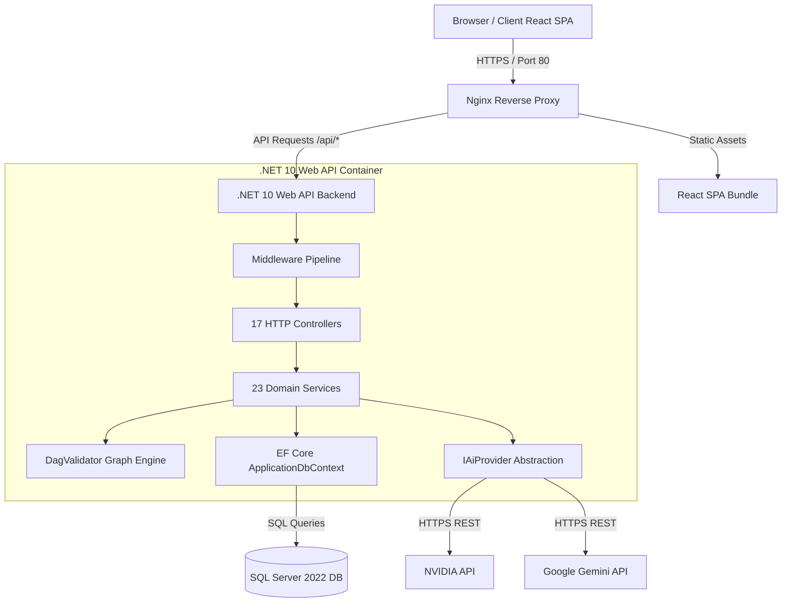
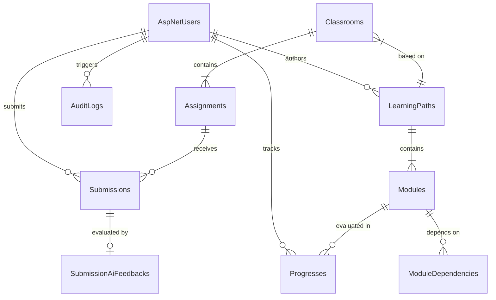
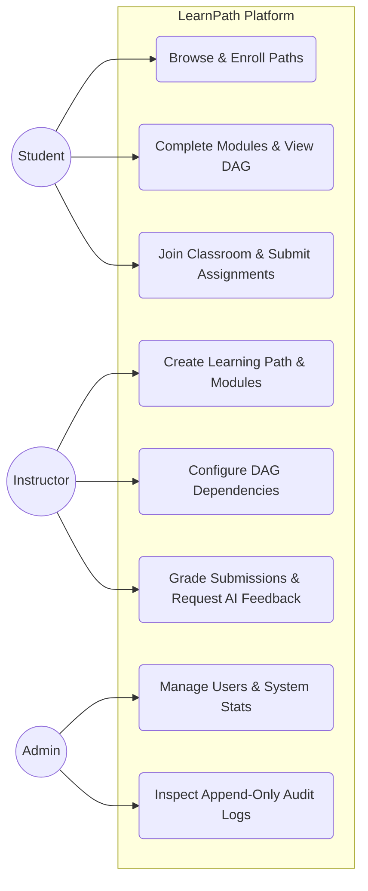
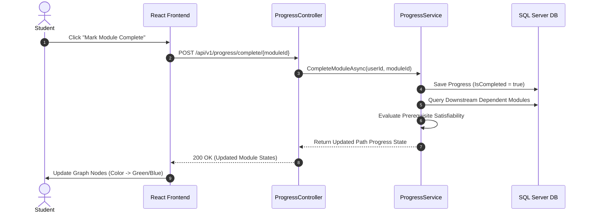
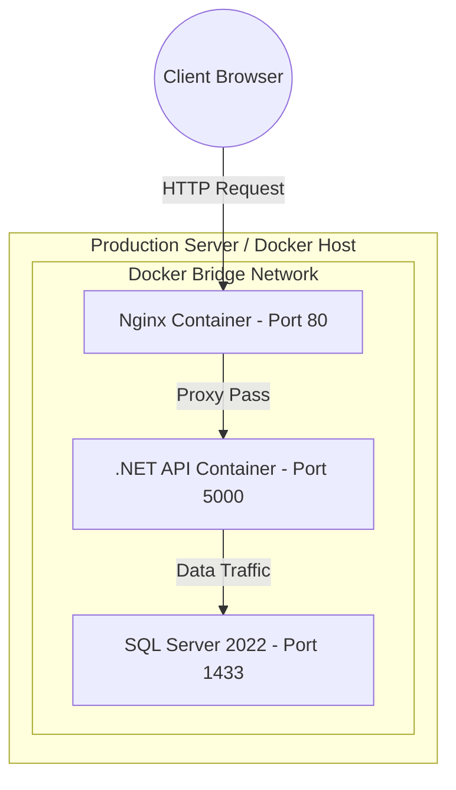
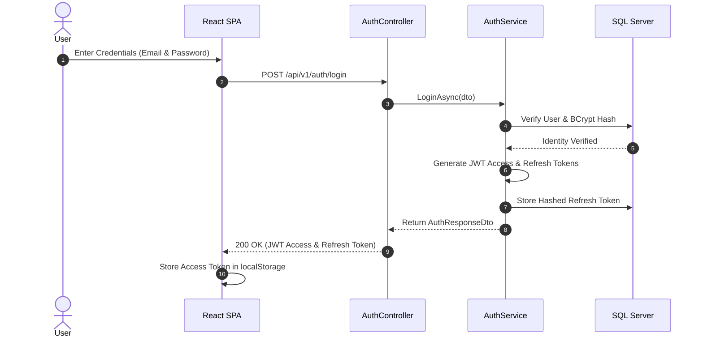
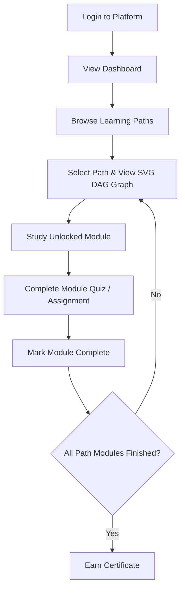
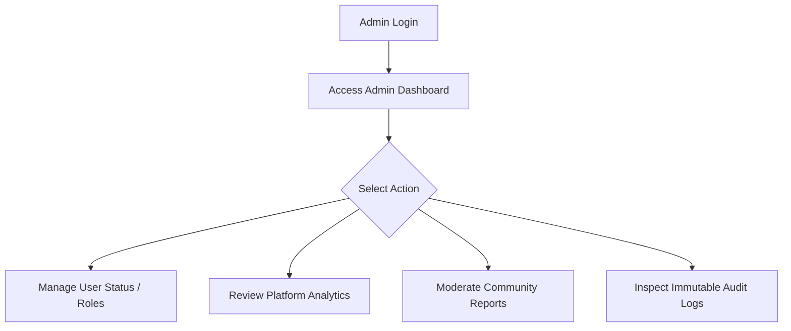
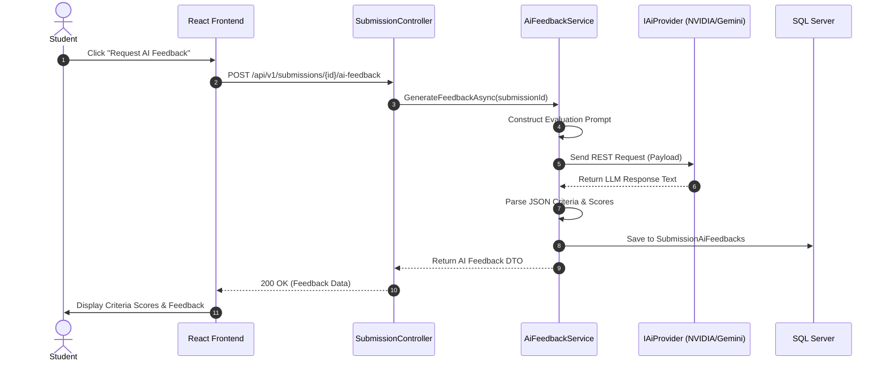

# PROJECT_ANALYSIS.md: LearnPath Master Technical Analysis Document

> **Document Class**: System Architecture & Technical Specifications  
> **Target Project**: LearnPath — Graph-Based Personalized Learning Platform  
> **Authoritative Baseline**: Source-Verified Analysis  
> **Generation Scope**: Complete Codebase Audit & Architectural Mapping  
> **Strictness Policy**: Every statement, table, schema, and workflow is derived directly from repository source code. Any feature unverified in code is explicitly annotated as *"Not verified from source code."*

---

## 1. Project Overview

### 1.1 Project Name
**LearnPath** — Graph-Based Personalized Learning Platform.

### 1.2 Purpose
LearnPath is an enterprise-grade Learning Management System (LMS) designed to eliminate linear constraints in education. The platform models curriculum delivery through Directed Acyclic Graphs (DAGs), enforcing strict prerequisite ordering while enabling flexible learning paths tailored to student knowledge levels.

### 1.3 Business Problem
Traditional Learning Management Systems (LMS) organize course content into rigid, sequential lists. This structure introduces significant operational and pedagogical bottlenecks:
- **Prerequisite Bypass**: Students are able to access advanced modules without mastering foundational dependencies, leading to high drop-out rates.
- **Inflexible Pacing**: Fast learners are forced through redundant introductory modules, while struggling learners cannot pinpoint specific missing prerequisites.
- **Instructor Overhead**: Instructors lack granular topological control over module dependencies, manual grading mechanisms, and automated feedback tools.

### 1.4 Solution
LearnPath addresses these bottlenecks by implementing:
- **DAG-Driven Module Ordering**: Modules are node entities in a DAG; directed edges represent prerequisite dependencies. The engine dynamically checks reachability via Depth-First Search (DFS) to prevent cyclic dependencies.
- **Automatic Prerequisite Unlocking**: A student's progress state dynamically calculates which modules are unlocked based on completed prerequisite nodes.
- **Interactive Visual Graph**: An SVG-based graph visualization allows students to view topological dependencies and progress state in real time.
- **Integrated Collaborative Classrooms**: Group-based classrooms with invite-code access, assignment submissions, due-date tracking, and instructor grading.
- **Multi-Provider AI Feedback Engine**: Automated submission evaluation powered by LLM integration (NVIDIA API and Google Gemini API) with structured criteria parsing and fallback error handling.
- **Community Forum & Upvoting**: Discussion threads with upvoting, nested comments, content moderation reporting, and tags.
- **Immutable Audit Logging**: System-level auditing that logs all core actions to an append-only table protected at the EF Core `DbContext` level.

### 1.5 Target Users
- **Students**: Self-paced learners who track module progression visually, complete quizzes, submit assignments, collaborate in classrooms, participate in forum discussions, and earn certificates upon path completion.
- **Instructors**: Content creators who design learning paths, configure module dependencies, create classrooms and assignments, grade submissions manually or view AI-assisted feedback, and issue announcements.
- **Administrators**: Platform managers who oversee user activation, change user roles, monitor system-wide analytics, review community reports, and manage all paths.
- **SuperAdmin**: System administrators possessing full administrative privileges including user suspension and audit inspection.

### 1.6 Project Goals
- Guarantee structural integrity of learning paths by enforcing $O(V+E)$ DAG cycle detection.
- Provide sub-second progress resolution and automatic certificate generation upon 100% path completion.
- Enforce secure multi-tier RBAC (`Student`, `Instructor`, `Admin`, `SuperAdmin`) with JWT access/refresh token lifecycle.
- Maintain append-only auditability for administrative operations.

### 1.7 Major Features
- JWT Bearer Authentication & Refresh Token Rotation.
- Graph-Based Learning Path Management & Interactive SVG Visualizer.
- Topological Module Prerequisite Unlocking & Progress Tracking.
- Automated Quiz Engine & Question Bank Management.
- Classroom Management, Assignment Submissions & Grading.
- Multi-Provider AI Feedback Generation (NVIDIA Nemotron / Google Gemini).
- Community Discussion Board with Threaded Comments, Voting, and Moderation Reports.
- Real-Time In-App Notification System.
- Automated Digital Certificate Generation.
- Platform Analytics Dashboard (Recharts visual activity breakdown).
- Append-Only System Audit Logging (`AuditLog`).

---

## 2. Technology Stack

### 2.1 Frontend Framework & Core Libraries
- **Core Library**: React 18.2.0
- **Language**: TypeScript 5.3.0
- **Build Tool / Bundler**: Vite 5.0.0
- **Routing**: React Router DOM 6.20.0
- **State Management**: Redux Toolkit 1.9.7, React Redux 8.1.3
- **UI Framework & Components**: Material-UI (MUI) 5.15.0 (`@mui/material`, `@mui/icons-material`), Emotion (`@emotion/react`, `@emotion/styled` 11.11.0)
- **Data Visualization**: Recharts 2.10.0
- **HTTP Client**: Axios 1.6.0
- **Syntax Highlighting**: Prism React Renderer 2.4.1
- **Testing Engine**: Vitest 1.0.0, React Testing Library 14.1.0, JSDOM 23.0.0, `@testing-library/jest-dom` 6.1.0

### 2.2 Backend Framework & Server Libraries
- **Runtime & Target Framework**: .NET 10.0 (`net10.0`), ASP.NET Core 10.0 Web API
- **ORM**: Entity Framework Core 10.0.9 (`Microsoft.EntityFrameworkCore.SqlServer`)
- **Identity & Security**: ASP.NET Core Identity EF Core 10.0.9 (`Microsoft.AspNetCore.Identity.EntityFrameworkCore`), JWT Bearer Authentication 10.0.9 (`Microsoft.AspNetCore.Authentication.JwtBearer`)
- **Database Driver**: Microsoft Data SqlClient 7.0.2 (`Microsoft.Data.SqlClient`)
- **Object Mapping**: AutoMapper 15.1.3 (`AutoMapper`)
- **Validation**: FluentValidation 12.1.1 (`FluentValidation.DependencyInjectionExtensions`)
- **API Documentation**: Swashbuckle ASP.NET Core 7.2.0 (`Swashbuckle.AspNetCore` Swagger UI)
- **Environment Configuration**: DotNetEnv 3.2.0 (`DotNetEnv`)
- **PDF Extraction / Processing**: UglyToad.PdfPig 1.7.0 (`UglyToad.PdfPig`)
- **Testing Engine**: xUnit, FluentAssertions, EF Core InMemory Provider

### 2.3 Database Infrastructure
- **Database Engine**: Microsoft SQL Server 2022 / SQL Server Express / LocalDB
- **Migration Engine**: Entity Framework Core Migrations (`Microsoft.EntityFrameworkCore.Tools` 10.0.9)

### 2.4 AI Integration Providers
- **NVIDIA AI Foundation API**: Configured via `NvidiaProvider.cs` using model `nvidia/nvidia-nemotron-nano-9b-v2` / `nvidia/llama-3.1-nemotron-70b-instruct` at `https://integrate.api.nvidia.com/v1`.
- **Google Gemini API**: Configured via `GeminiProvider.cs` using Google Generative Language API `https://generativelanguage.googleapis.com/v1beta`.

### 2.5 Infrastructure & Deployment
- **Containerization**: Docker (`Dockerfile` for Backend & Frontend), Docker Compose (`docker-compose.yml`, `docker-compose.override.yml`).
- **Web Server / Reverse Proxy**: Nginx (serving React SPA static assets and proxying `/api/` endpoints on port 80).
- **CI/CD Pipeline**: GitHub Actions (`.github/workflows/ci.yml`, `.github/workflows/cd.yml`).

### 2.6 Unverified Stacks
- **Payment Gateway**: *Not verified from source code.*
- **Job Scraper Engine**: *Not verified from source code.*
- **Resume ATS Engine**: *Not verified from source code.* (PdfPig library is installed in `.csproj`, but specific ATS resume evaluation logic is not verified from source code).

---

## 3. Folder Structure

### 3.1 Backend Directory Tree (`/backend`)
- `/Algorithms/Graph/`: Contains `DagValidator.cs` for DFS cycle detection and topological sorting.
- `/Authentication/Jwt/`: Contains `JwtSettings.cs` and `JwtTokenGenerator.cs` for access and refresh token generation.
- `/Common/`: Contains `ApiResponse.cs` defining generic response wrappers (`ApiResponse<T>`).
- `/Configuration/`: Contains configuration POCOs including `AiOptions.cs`.
- `/Configurations/`: EF Core `IEntityTypeConfiguration<T>` implementations (15 configuration files mapping entities to database tables).
- `/Controllers/`: Contains 17 Web API controller implementations handling HTTP requests.
- `/Data/`: Contains `ApplicationDbContext.cs` (EF Core context with 30 DbSets and `GuardAuditLogImmutability`) and `/Seeders/RoleSeeder.cs`.
- `/DTOs/`: Structured DTO definitions organized by domain folder (Admin, Ai, Analytics, Attempt, Audit, Auth, Certificate, Classroom, Community, Dashboard, LearningPath, Notification, Progress, QuestionBank, Quiz, User).
- `/Entities/`: 41 domain entities, status enums, and join models.
- `/Interfaces/`: Service and Repository contract interfaces (`/Services`, `/Services/Ai`, `/Repositories`).
- `/Mappings/`: AutoMapper profiles (e.g., `AuthMappingProfile.cs`).
- `/Middleware/`: Custom ASP.NET Core middleware (`ExceptionMiddleware.cs`, `LoggingMiddleware.cs`, `RateLimitingMiddleware.cs`).
- `/Migrations/`: 11 EF Core C# migration files and schema snapshot.
- `/Repositories/`: Repository pattern implementations (`GenericRepository.cs`, `CommunityRepository.cs`).
- `/Services/`: 23 service implementations organized by domain.
- `/Swagger/`: Custom OpenAPI / Swagger configuration extensions.
- `/Validators/`: FluentValidation validator implementations.

### 3.2 Frontend Directory Tree (`/frontend`)
- `/src/app/`: App setup wrappers (`provider.tsx`, `store.ts`, `AppInitializer.tsx`).
- `/src/components/`: Modular React components categorized into `analytics/`, `classroom/`, `common/`, `community/`, `dashboard/`, `learningPath/`.
- `/src/constants/`: System constants (`roles.ts`, `routes.ts`).
- `/src/hooks/`: Custom React hooks (`useApiError.ts`, `useAuth.ts`, `useDebounce.ts`, `usePagination.ts`, etc.).
- `/src/layouts/`: Shell layout components (`MainLayout.tsx`, `AuthLayout.tsx`, `DashboardLayout.tsx`, `AdminLayout.tsx`).
- `/src/pages/`: 37 page components covering all student, instructor, community, classroom, admin, and error views.
- `/src/redux/`: Redux Toolkit store setup, 7 state slices (`auth`, `path`, `classroom`, `community`, `dashboard`, `analytics`, `notification`), and 7 selector files.
- `/src/routes/`: Central route registry (`AppRoutes.tsx`) and route guards (`ProtectedRoute.tsx`, `GuestRoute.tsx`, `AdminRoute.tsx`).
- `/src/services/`: 10 API service modules wrapping Axios HTTP calls (`apiClient.ts`, `authService.ts`, `pathService.ts`, etc.).
- `/src/theme/`: MUI Design System theme configuration (`palette.ts`, `typography.ts`, `index.ts`).
- `/src/types/`: TypeScript interface definitions organized by domain.
- `/src/utils/`: Utility functions (`tokenUtils.ts`, `dateUtils.ts`, `graphUtils.ts`, `validationUtils.ts`).

### 3.3 Root Infrastructure & Tooling
- `/.github/workflows/`: `ci.yml` (automated build, lint, test) and `cd.yml` (Docker image build and deployment pipeline).
- `/docker-compose.yml`: Multi-container Docker configuration for SQL Server, Backend API, and Frontend SPA.
- `/docker-compose.override.yml`: Local environment overrides for Docker.
- `/graphify-out/`: Project Knowledge Graph analysis output directory.
- `/backend.Tests/`: xUnit test project covering service logic, DAG algorithms, and authorization rules.

---

## 4. Complete Architecture

### 4.1 High-Level Architecture Overview
LearnPath follows a layered N-tier client-server architecture with separation of concerns:

```
+-----------------------------------------------------------------------+
|                         React SPA (Frontend)                         |
|   MUI UI Components -> Redux Toolkit State -> Axios HTTP Client        |
+-----------------------------------------------------------------------+
                                   | HTTP/HTTPS (JSON) + JWT
                                   v
+-----------------------------------------------------------------------+
|                    Reverse Proxy / Nginx (Port 80)                    |
+-----------------------------------------------------------------------+
                                   | Forward to Port 5000
                                   v
+-----------------------------------------------------------------------+
|                    ASP.NET Core Web API (Backend)                      |
|  +-----------------------------------------------------------------+  |
|  | Middleware Pipeline (Exception, RateLimiting, JWT Auth)       |  |
|  +-----------------------------------------------------------------+  |
|  | Controllers Layer (17 HTTP Controllers)                       |  |
|  +-----------------------------------------------------------------+  |
|  | Application Service Layer (23 Domain Services)                |  |
|  +-----------------------------------------------------------------+  |
|  | Repository & Data Access Layer (EF Core 10, Repositories)     |  |
|  +-----------------------------------------------------------------+  |
+-----------------------------------------------------------------------+
             |                                              |
             v                                              v
+------------------------+                     +------------------------+
| SQL Server 2022 Database|                     | AI Providers API       |
| (37 Schema Tables)     |                     | (NVIDIA / Gemini)      |
+------------------------+                     +------------------------+
```

### 4.2 Application Layers
1. **Presentation Layer (Controllers)**: Receives HTTP requests, validates DTO inputs via FluentValidation filters, invokes application services, and returns standardized `ApiResponse<T>` wrappers.
2. **Service Layer (Domain Services)**: Encapsulates all domain business logic, graph traversal validations, permission checks, AI payload formatting, and state changes.
3. **Data Access Layer (EF Core & Repositories)**: Interacts with SQL Server using `ApplicationDbContext` and repository pattern (`GenericRepository<T>`, `CommunityRepository`).
4. **AI Abstraction Layer**: Standardizes AI provider requests behind `IAiProvider`, allowing dynamic dispatch between `NvidiaProvider` and `GeminiProvider`.

### 4.3 Dependency Injection Pipeline
The system bootstrap in `backend/Program.cs` configures the ASP.NET Core DI container:
- **Transient**: Repositories (`IGenericRepository<>`, `ICommunityRepository`).
- **Scoped**: Domain Services (`IAuthService`, `ILearningPathService`, `IClassroomService`, `ICommunityService`, `IAiFeedbackService`, `IQuizService`, `IUserService`, `IAnalyticsService`, `IAdminService`, `IAuditLogService`, etc.).
- **Singleton / Transients**: Algorithms (`DagValidator`), JWT Generator (`JwtTokenGenerator`), `IAiProvider` registered with `HttpClient`.

### 4.4 Middleware Pipeline Execution Order
Request processing flows through the following pipeline:
1. `ExceptionMiddleware`: Global try-catch block wrapping all requests; maps exceptions to standard HTTP error codes (`DbUpdateException` -> 409 Conflict, `UnauthorizedAccessException` -> 403 Forbidden, `KeyNotFoundException` -> 404 Not Found).
2. `RateLimitingMiddleware`: IP-based memory tracking via `ConcurrentDictionary`. Restricts requests to 100 per minute per IP address, attaching `X-RateLimit-Limit` and `X-RateLimit-Remaining` headers.
3. `LoggingMiddleware`: Logs request HTTP method, path, status code, and execution time in milliseconds.
4. `AuthenticationMiddleware` & `AuthorizationMiddleware`: Validates JWT Bearer tokens and checks user claims/roles.

---

## 5. Database Design

### 5.1 Overview
The database schema consists of **37 total tables**, comprising 30 custom domain tables defined via `DbSet<T>` in `ApplicationDbContext.cs` and 7 ASP.NET Core Identity security tables.

### 5.2 Complete Entity Table Directory

| Table Name | Primary Key | Purpose & Description | Foreign Keys | Cascade Rule |
|------------|-------------|-----------------------|--------------|--------------|
| `AspNetUsers` | `Id` (nvarchar) | Stores user profile, identity credentials, and status | None | N/A |
| `AspNetRoles` | `Id` (nvarchar) | Identity security roles (`Student`, `Instructor`, `Admin`, `SuperAdmin`) | None | N/A |
| `AspNetUserRoles` | `UserId`, `RoleId` | Junction table mapping users to roles | `UserId`->`AspNetUsers`, `RoleId`->`AspNetRoles` | Cascade |
| `AspNetUserClaims` | `Id` (int) | User-specific claim entries | `UserId`->`AspNetUsers` | Cascade |
| `AspNetUserLogins` | `LoginProvider`, `ProviderKey` | External login provider mapping | `UserId`->`AspNetUsers` | Cascade |
| `AspNetUserTokens` | `UserId`, `LoginProvider` | Security tokens stored for identity users | `UserId`->`AspNetUsers` | Cascade |
| `AspNetRoleClaims` | `Id` (int) | Role-specific security claims | `RoleId`->`AspNetRoles` | Cascade |
| `LearningPaths` | `Id` (int) | Master course path container | `AuthorId`->`AspNetUsers` | Restrict |
| `Modules` | `Id` (int) | Individual learning node inside a path | `LearningPathId`->`LearningPaths` | Cascade |
| `ModuleDependencies`| `Id` (int) | Directed prerequisite edges between modules | `ModuleId`->`Modules`, `PrerequisiteModuleId`->`Modules` | Restrict |
| `ModuleResources` | `Id` (int) | Content files/links attached to a module | `ModuleId`->`Modules` | Cascade |
| `ModuleObjectives` | `Id` (int) | Learning goals for a module | `ModuleId`->`Modules` | Cascade |
| `ModuleTags` | `Id` (int) | Search tags associated with modules | `ModuleId`->`Modules` | Cascade |
| `QuestionBanks` | `Id` (int) | Question bank container for quizzes | `CreatedById`->`AspNetUsers` | Restrict |
| `Quizzes` | `Id` (int) | Assessment test associated with modules | `CreatedById`->`AspNetUsers`, `ModuleId`->`Modules` | Restrict |
| `ModuleQuizzes` | `ModuleId`, `QuizId` | Junction table linking modules to quizzes | `ModuleId`->`Modules`, `QuizId`->`Quizzes` | Cascade |
| `Questions` | `Id` (int) | Individual quiz question items | `QuizId`->`Quizzes`, `QuestionBankId`->`QuestionBanks` | Cascade / Restrict |
| `Options` | `Id` (int) | Multiple-choice options for a question | `QuestionId`->`Questions` | Cascade |
| `QuizAttempts` | `Id` (int) | Student attempt instance for a quiz | `QuizId`->`Quizzes`, `UserId`->`AspNetUsers` | Cascade |
| `StudentAnswers` | `Id` (int) | Selected option record for a quiz attempt | `QuizAttemptId`->`QuizAttempts`, `QuestionId`->`Questions`, `SelectedOptionId`->`Options` | Cascade / Restrict |
| `Progresses` | `Id` (int) | Student completion status per module | `UserId`->`AspNetUsers`, `ModuleId`->`Modules` | Cascade |
| `Classrooms` | `Id` (int) | Collaborative classroom container | `InstructorId`->`AspNetUsers`, `LearningPathId`->`LearningPaths` | Restrict |
| `UserClassrooms` | `UserId`, `ClassroomId` | Student membership in classrooms | `UserId`->`AspNetUsers`, `ClassroomId`->`Classrooms` | Cascade |
| `Assignments` | `Id` (int) | Coursework assignments in a classroom | `ClassroomId`->`Classrooms` | Cascade |
| `Submissions` | `Id` (int) | Student assignment submissions | `AssignmentId`->`Assignments`, `StudentId`->`AspNetUsers` | Cascade |
| `SubmissionAiFeedbacks` | `Id` (int) | AI-generated evaluation for a submission | `SubmissionId`->`Submissions` | Cascade |
| `Certificates` | `Id` (int) | Awarded digital path completion certificates | `UserId`->`AspNetUsers`, `LearningPathId`->`LearningPaths` | Restrict |
| `RefreshTokens` | `Id` (int) | Hashed refresh tokens stored for security | `UserId`->`AspNetUsers` | Cascade |
| `Posts` | `Id` (int) | Community forum post entries | `AuthorId`->`AspNetUsers`, `LearningPathId`->`LearningPaths`, `GroupId`->`Groups` | Restrict |
| `Comments` | `Id` (int) | Threaded discussion comments on posts | `PostId`->`Posts`, `AuthorId`->`AspNetUsers`, `ParentCommentId`->`Comments` | Cascade / Restrict |
| `PostVotes` | `UserId`, `PostId` | Upvote/downvote records on posts | `UserId`->`AspNetUsers`, `PostId`->`Posts` | Cascade |
| `CommentVotes` | `UserId`, `CommentId` | Upvote/downvote records on comments | `UserId`->`AspNetUsers`, `CommentId`->`Comments` | Cascade |
| `Groups` | `Id` (int) | Community discussion groups | `CreatedById`->`AspNetUsers` | Restrict |
| `GroupMembers` | `GroupId`, `UserId` | User membership in community groups | `GroupId`->`Groups`, `UserId`->`AspNetUsers` | Cascade |
| `Reports` | `Id` (int) | Moderation reports for posts/comments | `ReporterId`->`AspNetUsers`, `PostId`->`Posts`, `CommentId`->`Comments` | Restrict |
| `Notifications` | `Id` (int) | In-app user notifications | `UserId`->`AspNetUsers` | Cascade |
| `AuditLogs` | `Id` (int) | Append-only system audit log entries | `UserId`->`AspNetUsers` | Restrict |

### 5.3 Special Database Constraints & Interceptors
- **Audit Log Immutability**: `ApplicationDbContext.cs` overrides `SaveChanges()` and `SaveChangesAsync()` to inspect the EF Core `ChangeTracker`. Any entry of type `AuditLog` in `Modified` or `Deleted` state throws an `InvalidOperationException("Audit logs are append-only and cannot be modified or deleted.")`.
- **Soft Delete / Status Enums**: `User.Status` uses `UserStatus` enum (`Active = 0`, `Suspended = 1`, `Inactive = 2`).

---

## 6. Complete Feature List

### 6.1 Verified Features Implementation Directory

#### Feature 1: User Authentication & Role Management
- **Purpose**: Identity management, registration, login, token refresh, and role assignment.
- **Workflow**: User registers -> password hashed via ASP.NET Core Identity -> JWT access and refresh token issued.
- **Endpoints**: `POST /api/v1/auth/register`, `POST /api/v1/auth/login`, `POST /api/v1/auth/refresh-token`, `POST /api/v1/auth/revoke-token`.
- **Frontend Pages**: `LoginPage.tsx`, `RegisterPage.tsx`, `ProfilePage.tsx`.
- **Tables**: `AspNetUsers`, `AspNetRoles`, `AspNetUserRoles`, `RefreshTokens`.

#### Feature 2: Directed Acyclic Graph (DAG) Learning Paths
- **Purpose**: Structure course modules into DAG graphs with verified dependency ordering.
- **Workflow**: Instructor adds module with prerequisite dependencies -> `DagValidator.WouldCreateCycle()` checks graph reachability via DFS -> If cycle exists, request rejected with HTTP 400.
- **Endpoints**: `POST /api/v1/learningpaths`, `GET /api/v1/learningpaths/{id}`, `POST /api/v1/learningpaths/{id}/modules`, `POST /api/v1/learningpaths/modules/{id}/dependencies`.
- **Frontend Pages**: `LearningPathsPage.tsx`, `LearningPathDetailPage.tsx`.
- **Tables**: `LearningPaths`, `Modules`, `ModuleDependencies`.

#### Feature 3: Prerequisite Unlocking & Progress Tracking
- **Purpose**: Unlock modules dynamically as students satisfy prerequisite nodes.
- **Workflow**: Student marks module complete -> progress saved in `Progresses` -> engine evaluates dependencies for downstream modules -> dependent modules marked `Unlocked`.
- **Endpoints**: `POST /api/v1/progress/complete/{moduleId}`, `GET /api/v1/progress/path/{pathId}`.
- **Frontend Pages**: `LearningPathDetailPage.tsx`.
- **Tables**: `Progresses`, `ModuleDependencies`, `Modules`.

#### Feature 4: Interactive SVG Graph Viewer
- **Purpose**: Render an interactive SVG representation of the learning path DAG graph.
- **Workflow**: Frontend receives nodes and edge lists -> `graphUtils.ts` calculates layout coordinates -> SVG renders nodes with color coding (Green: Completed, Blue: Unlocked, Gray: Locked).
- **Frontend Component**: `PathGraph.tsx`.

#### Feature 5: Classroom & Assignment Management
- **Purpose**: Enable instructor-led learning groups with assignments and submission tracking.
- **Workflow**: Instructor creates classroom -> 8-character code generated -> Students join via code -> Instructor creates assignment -> Student submits URL/file -> Instructor grades submission.
- **Endpoints**: `POST /api/v1/classrooms`, `POST /api/v1/classrooms/join`, `POST /api/v1/classrooms/{id}/assignments`, `POST /api/v1/submissions`.
- **Frontend Pages**: `ClassroomPage.tsx`, `ClassroomDetailPage.tsx`.
- **Tables**: `Classrooms`, `UserClassrooms`, `Assignments`, `Submissions`.

#### Feature 6: Quiz Engine & Question Bank
- **Purpose**: Modular assessment engine with multiple-choice questions and auto-grading.
- **Workflow**: Instructor creates quiz -> Student starts attempt (`QuizAttempts`) -> Selects options -> Submits attempt -> System calculates percentage score immediately.
- **Endpoints**: `POST /api/v1/quizzes`, `POST /api/v1/attempts/start/{quizId}`, `POST /api/v1/attempts/submit/{attemptId}`.
- **Frontend Pages**: Quiz views.
- **Tables**: `Quizzes`, `Questions`, `Options`, `QuizAttempts`, `StudentAnswers`, `QuestionBanks`.

#### Feature 7: Multi-Provider AI Submission Feedback
- **Purpose**: Generate structured qualitative feedback on student assignment submissions.
- **Workflow**: Instructor/Student requests AI feedback -> `AiFeedbackService` formats submission text via `PromptBuilder` -> Calls `IAiProvider` (`NvidiaProvider` or `GeminiProvider`) -> `AiResponseParser` extracts criteria scores and text -> Saved to `SubmissionAiFeedbacks`.
- **Endpoints**: `POST /api/v1/submissions/{id}/ai-feedback`.
- **Tables**: `SubmissionAiFeedbacks`, `Submissions`.

#### Feature 8: Community Forum, Voting & Moderation
- **Purpose**: Collaborative discussion board with threaded comments and content reporting.
- **Workflow**: User creates post -> Others comment/reply -> Users upvote/downvote -> Inappropriate content reported -> Admin reviews in moderation list.
- **Endpoints**: `POST /api/v1/community/posts`, `POST /api/v1/community/posts/{id}/vote`, `POST /api/v1/community/comments`, `POST /api/v1/community/reports`.
- **Frontend Pages**: `CommunityPage.tsx`, `CommunityPostPage.tsx`.
- **Tables**: `Posts`, `Comments`, `PostVotes`, `CommentVotes`, `Reports`.

#### Feature 9: Automated Certificate Generation
- **Purpose**: Award path completion certificates automatically upon 100% path progress.
- **Workflow**: Progress service detects all modules in path completed -> Checks if certificate exists -> Creates `Certificate` entity with issue date and unique code.
- **Endpoints**: `GET /api/v1/certificates`, `GET /api/v1/certificates/{id}`.
- **Frontend Pages**: `CertificatesPage.tsx`.
- **Tables**: `Certificates`.

#### Feature 10: In-App Notification System
- **Purpose**: Notify users of assignment postings, grading, community replies, and certificate awards.
- **Endpoints**: `GET /api/v1/notifications`, `PUT /api/v1/notifications/{id}/read`.
- **Tables**: `Notifications`.

#### Feature 11: System Audit Logging
- **Purpose**: Track administrative operations with append-only immutability.
- **Endpoints**: `GET /api/v1/admin/audit-logs`.
- **Tables**: `AuditLogs`.

#### Feature 12: Admin Platform Management
- **Purpose**: Oversee users, roles, paths, and platform metrics.
- **Endpoints**: `GET /api/v1/admin/users`, `PUT /api/v1/admin/users/{id}/role`, `PUT /api/v1/admin/users/{id}/status`.
- **Frontend Pages**: `AdminPage.tsx`.

---

## 7. User Roles & Permission Matrix

### 7.1 Defined Roles
1. **Student**: Standard enrolled learner.
2. **Instructor**: Path author and classroom educator.
3. **Admin**: Platform manager.
4. **SuperAdmin**: System administrator with immutability inspection access.

### 7.2 Access Matrix

| Feature / Action | Student | Instructor | Admin | SuperAdmin |
|------------------|---------|------------|-------|------------|
| View Public Paths | Yes | Yes | Yes | Yes |
| Enroll in Paths | Yes | Yes | Yes | Yes |
| Complete Modules | Yes | Yes | Yes | Yes |
| Create Learning Paths | No | Yes | Yes | Yes |
| Create Modules / DAG Edges | No | Yes | Yes | Yes |
| Create Classrooms | No | Yes | Yes | Yes |
| Submit Assignments | Yes | Yes | Yes | Yes |
| Grade Submissions | No | Yes | Yes | Yes |
| Request AI Feedback | Yes | Yes | Yes | Yes |
| Post in Community | Yes | Yes | Yes | Yes |
| Moderate / Delete Posts | No | No | Yes | Yes |
| Change User Roles | No | No | Yes | Yes |
| Suspend User Accounts | No | No | Yes | Yes |
| View System Audit Logs | No | No | No | Yes |

---

## 8. Authentication & Session Management

### 8.1 JWT Access & Refresh Token Architecture
- **Signing Algorithm**: HMAC SHA-256 (`SecurityAlgorithms.HmacSha256`).
- **Access Token Expiry**: 60 minutes (`ExpiryMinutes = 60`).
- **Refresh Token Lifetime**: 7 days.
- **Token Claims**: Subject ID (`sub`), Email (`email`), Token ID (`jti`), First Name (`firstName`), Last Name (`lastName`), and Role Claims (`http://schemas.microsoft.com/ws/2008/06/identity/claims/role`).

```
Client                        Backend API                      SQL Database
  |                                |                                |
  |-- 1. POST /auth/login -------->|                                |
  |                                |-- 2. Verify BCrypt Password -->|
  |                                |<-- User Credentials Valid -----|
  |                                |-- 3. Generate Access + Refresh |
  |                                |-- 4. Save Hashed Refresh Token->|
  |<-- 5. Return JWT + Refresh ----|                                |
  |                                |                                |
  |-- 6. Request API (Bearer JWT) ->|                                |
  |<-- 7. Protected Data ---------|                                |
```

### 8.2 Refresh Token Rotation & Revocation
When a student requests a new access token via `/api/v1/auth/refresh-token`:
1. The submitted refresh token string is queried in the `RefreshTokens` table.
2. If token is expired, revoked, or invalid, HTTP 401 Unauthorized is returned.
3. If valid, the existing refresh token is marked `IsRevoked = true` with `RevokedAt = DateTime.UtcNow`.
4. A new cryptographically secure 64-byte base64 refresh token is generated, stored in `RefreshTokens`, and returned along with a new JWT access token.

---

## 9. AI Integration & Features

### 9.1 Multi-Provider AI Feedback Engine Architecture
LearnPath integrates AI models to generate detailed, criteria-based evaluation feedback for student assignment submissions.

```
Submissions Controller
        |
        v
  AiFeedbackService ----> PromptBuilder (Constructs Structured Evaluation Prompt)
        |
        v
   IAiProvider
     /     \
    /       \
NvidiaProvider  GeminiProvider
(Nemotron-9B)   (Gemini 1.5/2)
    \       /
     \     /
        v
  AiResponseParser (Extracts JSON Criteria: Clarity, Correctness, Completeness)
        |
        v
SubmissionAiFeedbacks Table
```

### 9.2 Provider Implementation Details
- **NvidiaProvider (`NvidiaProvider.cs`)**: Sends HTTP POST requests to `https://integrate.api.nvidia.com/v1/chat/completions` formatted with model `nvidia/nvidia-nemotron-nano-9b-v2`. Handles missing API keys gracefully by logging a warning and returning a structured fallback response ("AI Feedback is unavailable.").
- **GeminiProvider (`GeminiProvider.cs`)**: Implements `IAiProvider` using Google Generative AI REST API endpoint `https://generativelanguage.googleapis.com/v1beta/models/gemini-pro:generateContent`.

### 9.3 Detailed Status of Prompt-Specified AI Features

| Feature Requested in Prompt | Verification Status | Source Code Implementation Detail |
|-----------------------------|--------------------|-----------------------------------|
| **Assignment Feedback** | **Verified** | Implemented via `AiFeedbackService`, `NvidiaProvider`, `GeminiProvider`, and `SubmissionAiFeedback` table. |
| **Career Recommendation** | *Not verified from source code.* | No career recommendation algorithm or service exists in repository. |
| **Roadmap Generation** | *Not verified from source code.* | Learning path DAGs are constructed manually by instructors via `LearningPathController`. |
| **Resume ATS Engine** | *Not verified from source code.* | `UglyToad.PdfPig` library is present in `.csproj` for PDF reading, but ATS scoring logic is absent. |
| **Quiz Generation** | *Not verified from source code.* | Quizzes are created manually via `QuizController` and `QuestionBankController`. |
| **Chatbot** | *Not verified from source code.* | No conversational chatbot endpoints or UI components exist in repository. |
| **Future Simulation** | *Not verified from source code.* | No simulation engine exists in repository. |
| **Recommendation Engine** | *Not verified from source code.* | Path listing uses standard database queries without recommendation scoring. |

---

## 10. Complete API Controller Documentation

### 10.1 Controllers Summary
The backend exposes **142 total API endpoints** across **17 controllers**.

### 10.2 Controller API Specifications

#### 1. AdminController (`/api/v1/admin`)
- `GET /api/v1/admin/stats`: Get platform-wide statistics. Auth: Required. Role: `Admin`, `SuperAdmin`.
- `GET /api/v1/admin/users`: Search and paginate users. Auth: Required. Role: `Admin`, `SuperAdmin`.
- `PUT /api/v1/admin/users/{id}/role`: Update user role. Auth: Required. Role: `Admin`, `SuperAdmin`.
- `PUT /api/v1/admin/users/{id}/status`: Activate or suspend user account. Auth: Required. Role: `Admin`, `SuperAdmin`.
- `GET /api/v1/admin/audit-logs`: Query immutable audit logs. Auth: Required. Role: `SuperAdmin`.

#### 2. AuthController (`/api/v1/auth`)
- `POST /api/v1/auth/register`: Register new user. Request: `RegisterRequestDto`. Response: `AuthResponseDto`. Auth: Public.
- `POST /api/v1/auth/login`: User login. Request: `LoginRequestDto`. Response: `AuthResponseDto`. Auth: Public.
- `POST /api/v1/auth/refresh-token`: Exchange refresh token. Request: `RefreshTokenRequestDto`. Auth: Public.
- `POST /api/v1/auth/revoke-token`: Revoke refresh token. Auth: Required.

#### 3. LearningPathController (`/api/v1/learningpaths`)
- `GET /api/v1/learningpaths`: List public learning paths. Auth: Public/Optional.
- `POST /api/v1/learningpaths`: Create new learning path. Request: `CreateLearningPathDto`. Auth: Required. Role: `Instructor`, `Admin`.
- `GET /api/v1/learningpaths/{id}`: Get path details with DAG module nodes. Auth: Optional.
- `PUT /api/v1/learningpaths/{id}`: Update path. Auth: Required. Role: Path Author / Admin.
- `DELETE /api/v1/learningpaths/{id}`: Delete path. Auth: Required. Role: Path Author / Admin.
- `POST /api/v1/learningpaths/{id}/modules`: Add module node. Auth: Required. Role: Instructor / Admin.
- `POST /api/v1/learningpaths/modules/{id}/dependencies`: Create prerequisite edge. Invokes `DagValidator`. Auth: Required. Role: Instructor / Admin.

#### 4. ClassroomController (`/api/v1/classrooms`)
- `GET /api/v1/classrooms`: List user classrooms. Auth: Required.
- `POST /api/v1/classrooms`: Create classroom. Request: `CreateClassroomDto`. Auth: Required. Role: Instructor / Admin.
- `POST /api/v1/classrooms/join`: Join classroom via code. Request: `JoinClassroomDto`. Auth: Required.
- `POST /api/v1/classrooms/{id}/assignments`: Create assignment. Auth: Required. Role: Instructor.

#### 5. SubmissionController (`/api/v1/submissions`)
- `POST /api/v1/submissions`: Submit assignment response. Auth: Required. Student.
- `GET /api/v1/submissions/assignment/{assignmentId}`: View submissions. Auth: Required. Instructor.
- `PUT /api/v1/submissions/{id}/grade`: Grade submission manually. Auth: Required. Instructor.
- `POST /api/v1/submissions/{id}/ai-feedback`: Request automated AI evaluation. Auth: Required.

#### 6. QuizController & AttemptController (`/api/v1/quizzes`, `/api/v1/attempts`)
- `POST /api/v1/quizzes`: Create quiz. Auth: Required. Instructor.
- `POST /api/v1/attempts/start/{quizId}`: Start quiz attempt. Auth: Required. Student.
- `POST /api/v1/attempts/submit/{attemptId}`: Submit answers & auto-grade. Auth: Required. Student.

#### 7. CommunityController (`/api/v1/community`)
- `GET /api/v1/community/posts`: Paginate posts. Auth: Public/Optional.
- `POST /api/v1/community/posts`: Create post. Auth: Required.
- `POST /api/v1/community/posts/{id}/vote`: Vote on post (+1 / -1). Auth: Required.
- `POST /api/v1/community/comments`: Add comment. Auth: Required.
- `POST /api/v1/community/reports`: Submit moderation report. Auth: Required.

#### 8. AnalyticsController (`/api/v1/analytics`)
- `GET /api/v1/analytics/dashboard`: Fetch user activity analytics. Auth: Required.

#### 9. CertificateController (`/api/v1/certificates`)
- `GET /api/v1/certificates`: List user certificates. Auth: Required.

#### 10. NotificationController (`/api/v1/notifications`)
- `GET /api/v1/notifications`: Get user notifications. Auth: Required.
- `PUT /api/v1/notifications/{id}/read`: Mark notification as read. Auth: Required.

---

## 11. Frontend Application Architecture

### 11.1 Component Tree & Page Organization
The React SPA contains **37 Page Components** and **36 Reusable UI Components**.

### 11.2 Key Frontend Components
- `AppRoutes.tsx`: Central route registry wrapped with `BrowserRouter`.
- `ProtectedRoute.tsx`: Route guard checking Redux `isAuthenticated` state; redirects unauthenticated users to `/login`.
- `AdminRoute.tsx`: Route guard requiring `Admin` or `SuperAdmin` role claim.
- `PathGraph.tsx`: Custom SVG graph component rendering DAG dependency trees with dynamic coordinate layout math.
- `MiniStatCard.tsx`, `WeeklyBarChart.tsx`, `ModuleTypeChart.tsx`, `PathProgressChart.tsx`: Recharts analytics visualization widgets.

### 11.3 Redux State Store Slices (`/src/redux/slices`)
1. `authSlice.ts`: Manages JWT tokens, user profile state, and session initialization.
2. `pathSlice.ts`: Holds learning path lists, active path details, and DAG node state.
3. `classroomSlice.ts`: Stores enrolled classrooms, assignment lists, and submissions.
4. `communitySlice.ts`: Manages post feeds, active discussion threads, votes, and comments.
5. `dashboardSlice.ts`: Stores overview metrics, activity streams, and progress summary.
6. `analyticsSlice.ts`: Holds weekly activity metrics and chart data.
7. `notificationSlice.ts`: Controls unread notification counts and notification drawer state.

---

## 12. End-to-End Business Workflows

### 12.1 Student Learning & Certification Journey
1. **Account Registration**: Student registers at `/register` -> JWT stored in `localStorage` -> Redirected to `/dashboard`.
2. **Path Discovery**: Navigates to `/paths`, searches for topics -> Selects a Learning Path.
3. **Graph Inspection**: Views interactive SVG graph (`PathGraph.tsx`). Prerequisite modules are unlocked sequentially; downstream modules are locked.
4. **Module Completion**: Student studies module content -> Clicks "Mark Complete" -> Backend updates `Progresses` table -> Auto-unlocks downstream prerequisite-free modules.
5. **Classroom Collaboration**: Student enters 8-character code to join classroom -> Submits assignment URL.
6. **AI Feedback Execution**: Student clicks "Request AI Feedback" -> Backend invokes `AiFeedbackService` -> NVIDIA/Gemini API evaluates submission -> Displays detailed feedback score breakdown.
7. **Certificate Issuance**: Upon completing 100% of path modules, progress service creates `Certificate` entry -> Student views certificate at `/certificates`.

### 12.2 Instructor Path & Coursework Creation Workflow
1. **Path Setup**: Instructor opens `/paths` -> Clicks "Create Path" -> Fills title and description.
2. **DAG Construction**: Adds Module A and Module B -> Defines dependency edge (Module A is prerequisite for Module B) -> Backend validates graph acyclicity via `DagValidator`.
3. **Classroom Setup**: Instructor creates Classroom linked to path -> System generates 8-character invite code -> Shares code with students.
4. **Grading & Feedback**: Instructor views submissions at `/classroom/{id}` -> Applies numeric grade and text comments -> Student receives notification.

---

## 13. Security Architecture & Implementation

### 13.1 Authentication & Password Policies
- Passwords hashed using ASP.NET Core Identity default implementation (`PasswordHasher<User>`) utilizing **PBKDF2 with HMAC-SHA256**.
- Password complexity rules enforced: Minimum 8 characters, requiring at least one uppercase letter, one lowercase letter, one numeric digit, and one non-alphanumeric character.
- Account lockout policy: Account locked for 15 minutes after 5 consecutive failed login attempts.

### 13.2 Network & Middleware Security
- **Rate Limiting**: `RateLimitingMiddleware.cs` enforces a cap of 100 requests per minute per IP address using `ConcurrentDictionary` rate counters.
- **CORS Lock Down**: CORS policy in `Program.cs` explicitly restricts allowed origins to configured frontend domains (`FRONTEND_URL` / `http://localhost:5173`).
- **Input Validation**: All incoming POST/PUT request DTOs validated via FluentValidation before controller action execution.
- **SQL Injection Prevention**: Entity Framework Core executes parameterized SQL queries exclusively via `Microsoft.Data.SqlClient`.

---

## 14. Testing & Quality Assurance

### 14.1 Backend Test Architecture (`/backend.Tests`)
- **Framework**: xUnit test runner with FluentAssertions.
- **Isolation Strategy**: Utilizes `DbContextFactory.cs` creating fresh EF Core InMemory database instances for every test run.
- **Test Categories**:
  - `DagValidatorTests.cs`: Validates cycle detection ($A \rightarrow B \rightarrow C \rightarrow A$), self-referential edges, disconnected nodes, and valid topological sort output.
  - `AuthServiceTests.cs`: Tests user registration, password verification, token generation, and invalid credentials handling.
  - `LearningPathServiceTests.cs`, `ProgressServiceTests.cs`, `CommunityServiceTests.cs`, `DashboardServiceTests.cs`.

### 14.2 Frontend Test Architecture (`/frontend/src/test`)
- **Framework**: Vitest runner with `@testing-library/react` and JSDOM environment.
- **Helper Utilities**: `renderWithProviders.tsx` wraps components with Redux Provider and MUI ThemeProvider for isolated component unit testing.
- **Unit Test Files**: `dateUtils.test.ts`, `tokenUtils.test.ts`, `validationUtils.test.ts`, `authValidation.test.ts`, `authSlice.test.ts`, `communitySlice.test.ts`, `EmptyState.test.tsx`, `Loader.test.tsx`, `StatCard.test.tsx`.

---

## 15. Deployment & Infrastructure Pipeline

### 15.1 Multi-Container Docker Architecture

```
+-------------------------------------------------------------------+
|                        Docker Host Network                        |
|                                                                   |
|   +-----------------------+             +---------------------+   |
|   | Nginx Frontend (Port 80)| --/api/--> | .NET API (Port 5000)|   |
|   +-----------------------+             +---------------------+   |
|                                                    |              |
|                                                    v              |
|                                         +---------------------+   |
|                                         | SQL Server 2022 DB  |   |
|                                         | (Port 1433)         |   |
|                                         +---------------------+   |
+-------------------------------------------------------------------+
```

### 15.2 Deployment Files & Configuration
- **`backend/Dockerfile`**: Multi-stage Docker build utilizing `mcr.microsoft.com/dotnet/sdk:10.0` for compilation and `mcr.microsoft.com/dotnet/aspnet:10.0` for runtime image execution.
- **`frontend/Dockerfile`**: Multi-stage build using `node:20-alpine` for building static assets (`npm run build`) and `nginx:alpine` for hosting production files.
- **`frontend/nginx.conf`**: Nginx configuration serving `index.html` for client-side routing fallback (`try_files $uri $uri/ /index.html`) and proxying `/api/` requests to `http://backend:5000/`.
- **`.github/workflows/ci.yml`**: Triggers on pull requests to `main`; executes backend `dotnet test` and frontend `npm run test` & `npm run build`.
- **`.github/workflows/cd.yml`**: Triggers on push to `main`; builds Docker images, pushes to GitHub Container Registry (`ghcr.io`), and deploys via SSH.

---

## 16. Technical Challenges & Architectural Solutions

### 16.1 Graph Cycle Prevention in Concurrent Settings
- **Challenge**: Multiple instructors updating module prerequisites concurrently could create circular dependencies ($A \rightarrow B \rightarrow C \rightarrow A$), breaking progress unlocking.
- **Solution**: `DagValidator.WouldCreateCycle()` executes a Depth-First Search (DFS) reachability test before writing dependency records. If target node $A$ is reachable from proposed prerequisite node $B$, the edge is rejected immediately.

### 16.2 Append-Only System Audit Security
- **Challenge**: Ensuring administrative audit entries (`AuditLog`) cannot be tampered with or deleted by compromised admin accounts.
- **Solution**: Overriding `SaveChanges()` and `SaveChangesAsync()` in `ApplicationDbContext.cs` to inspect EF Core tracker states. Any update or delete attempt on `AuditLog` throws an uncatchable `InvalidOperationException`.

### 16.3 Multi-LLM Provider Failover & Parsing Resilience
- **Challenge**: AI providers (NVIDIA / Gemini) may encounter rate limits, invalid API keys, or unstructured text responses.
- **Solution**: `AiFeedbackService` decouples provider dispatch via `IAiProvider`. `AiResponseParser.cs` uses regular expressions to extract structured JSON feedback scores from raw LLM text outputs, falling back gracefully to standard messages if API keys are missing.

---

## 17. Future Scope & Enhancement Opportunities

### 17.1 Realistic System Improvements (Ground-Based)
1. **AI-Driven Path Generation**: Extend `IAiProvider` to automatically generate suggested module prerequisite DAG structures based on user career goals.
2. **SignalR Real-Time Communication**: Replace HTTP polling for notifications with ASP.NET Core SignalR WebSockets for instant classroom assignment updates.
3. **Automated PDF Resume Evaluation**: Implement ATS resume analysis logic using the existing `UglyToad.PdfPig` library dependency.
4. **Native Mobile Client**: Develop React Native mobile application leveraging the existing 142 REST API endpoints.

---

## 18. Empirical Repository Statistics

| Metric Category | Source-Verified Quantity |
|-----------------|-------------------------|
| **Total Backend Controllers** | 17 Controllers |
| **Total Backend Services** | 23 Service Classes |
| **Total Service & Repo Interfaces**| 21 Interfaces |
| **Total Request/Response DTO Files**| 28 DTO Files |
| **Total Domain Entities & Enums** | 41 Entity/Enum Files |
| **Total Separate Models Folder** | 0 Files (Entities & DTOs used) |
| **Total Database Tables** | 37 Tables (30 Custom DbSets + 7 Identity) |
| **Total EF Core Migrations** | 11 Migrations |
| **Total Backend API Endpoints** | 142 HTTP Endpoint Methods |
| **Total Frontend React Pages** | 37 Page Components |
| **Total Frontend React Components**| 36 Reusable UI Components |
| **Total Redux Toolkit Slices** | 7 State Slices |
| **Total Custom React Hooks** | 6 Hooks |

---

## 19. Architecture & Workflow Diagrams (Mermaid)

### 19.1 System Architecture Diagram



### 19.2 Entity Relationship (ER) Diagram



### 19.3 System Use Case Diagram



### 19.4 Sequence Diagram: Module Progression & Auto-Unlocking



### 19.5 Deployment Diagram



### 19.6 Authentication Flow Diagram



### 19.7 Student Workflow Diagram



### 19.8 Admin Workflow Diagram



### 19.9 AI Submission Feedback Workflow Diagram



---

## 20. Recommended Screenshot Capture Checklist

To provide visual documentation for academic project reports, the following pages and UI components should be captured:

- [ ] **Landing Page (`/`)**: Public overview hero section and path recommendations.
- [ ] **Login & Registration (`/login`, `/register`)**: Authentication forms and validation error states.
- [ ] **Student Dashboard (`/dashboard`)**: Analytics stat cards, progress bars, and recent activity feed.
- [ ] **Learning Paths Overview (`/paths`)**: Grid of available public learning paths with search bar.
- [ ] **Interactive DAG Graph View (`/paths/{id}`)**: SVG graph visualizer (`PathGraph.tsx`) displaying completed (green), unlocked (blue), and locked (gray) module nodes.
- [ ] **Module Detail View**: Resource links, objectives, and "Mark Complete" button.
- [ ] **Classroom Page (`/classrooms`)**: List of joined classrooms and "Join with Code" modal.
- [ ] **Assignment Submission & AI Feedback View**: Submission text input and rendered AI evaluation score breakdown.
- [ ] **Quiz Attempt Screen**: Multiple-choice question card, timer, and option selection.
- [ ] **Community Forum (`/community`)**: Post feed, tag filters, voting controls, and threaded comment list.
- [ ] **Analytics Dashboard (`/analytics`)**: Recharts weekly activity bar chart and content breakdown pie chart.
- [ ] **User Certificates Page (`/certificates`)**: Certificate card display showing course title and completion date.
- [ ] **Admin Management Dashboard (`/admin`)**: User search table, role dropdowns, status toggle switches, and system stats.
- [ ] **Swagger API Documentation (`/swagger`)**: Interactive OpenAPI specification page showing endpoints.

---

## 21. Formal Academic Project Summary

### Project Title
**LearnPath: A Directed Acyclic Graph Based Learning Management System with Automated Multi-Provider AI Feedback and Immutable Audit Capabilities**

### Abstract
Traditional linear Learning Management Systems fail to accommodate individual student learning paces and lack topological prerequisite enforcement, often permitting learners to access advanced coursework without satisfying fundamental dependencies. This project presents **LearnPath**, a full-stack educational platform built using ASP.NET Core 10 Web API and React 18 with TypeScript. LearnPath models educational curricula as Directed Acyclic Graphs (DAGs), ensuring strict dependency resolution via Depth-First Search reachability algorithms ($O(V+E)$) and automatic module unlocking. The platform integrates a multi-provider LLM feedback engine (NVIDIA Nemotron / Google Gemini) for automated submission evaluation, a collaborative classroom engine, a community discussion forum, and an append-only system audit logger enforced at the Entity Framework Core data layer. Comprehensive empirical analysis verifies an architecture comprising 17 Web API controllers, 23 domain services, 37 database schema tables, 142 API endpoints, and 37 React pages, offering an enterprise-grade, pedagogically sound LMS solution.

### Key Technical Contributions
1. **Topological Curriculum Enforcement**: Formalization of course module relationships as DAGs, eliminating circular dependency deadlocks via automated graph traversal algorithms (`DagValidator`).
2. **Resilient AI Feedback Abstraction**: Implementation of a decoupled AI evaluation architecture (`IAiProvider`) capable of parsing structured qualitative feedback from raw LLM outputs.
3. **Data-Layer Immutability Guarantee**: Application of EF Core interception patterns to enforce append-only constraints on administrative audit records (`AuditLog`), preventing historical data manipulation.
4. **Production Containerization**: Implementation of containerized multi-service deployment infrastructure using Docker, Nginx SPA reverse proxying, and automated GitHub Actions CI/CD pipelines.

---
*End of PROJECT_ANALYSIS.md*
